# Project Dependencies

This document is automatically generated from `CMakeLists.txt` files for `restcl`.

## Dependency Diagram

```mermaid
graph TD
    restcl["restcl::restcl"]

    subgraph Platform["Platform-Specific HTTP Backend"]
        LIBCURL["libcurl >= 8.7 (Linux / macOS)"]
        ACW32H["acw32h 2.7.4 (Windows / MSVC)"]
    end

    subgraph Core["Core Dependencies (via CPM)"]
        NLOHMANNJSON["nlohmann_json v3.12.0"]
        SPLITURI["SplitUri 3.0.3"]
        AZURECPPUTILS["AzureCppUtils 3.2.9"]
        STRING2MAP["string2map 2.6.1"]
        RUNONEND["RunOnEnd 1.4.5"]
        RWLENVELOPE["RWLEnvelope 1.5.3"]
        ASYNCHRONY["asynchrony 2.3.3"]
        ARRP["arrp 1.2.0"]
        CTRE["ctre v3.11.0"]
    end

    subgraph Test["Test Dependencies (Optional)"]
        GOOGLETEST["googletest v1.17.0"]
    end

    restcl --> LIBCURL
    restcl --> ACW32H
    restcl --> NLOHMANNJSON
    restcl --> SPLITURI
    restcl --> AZURECPPUTILS
    restcl --> STRING2MAP
    restcl --> RUNONEND
    restcl --> RWLENVELOPE
    restcl --> ASYNCHRONY
    restcl --> ARRP
    restcl --> CTRE
    restcl -. "BUILD_TESTS=ON" .-> GOOGLETEST
```

## Dependency Breakdown

| Dependency | Repository / Target | Version | Type | Scope / Platform |
| :--- | :--- | :--- | :--- | :--- |
| **libcurl** | `System / CURL` | >= 8.7 | `find_package` | Linux / macOS (GCC, Clang, AppleClang) |
| **acw32h** | [`SiddiqSoft/acw32h`](https://github.com/SiddiqSoft/acw32h) | 2.7.4 | `CPM` | Windows (MSVC) |
| **nlohmann_json** | [`nlohmann/json`](https://github.com/nlohmann/json) | v3.12.0 | `CPM` | All Platforms (`INTERFACE`) |
| **SplitUri** | [`SiddiqSoft/SplitUri`](https://github.com/SiddiqSoft/SplitUri) | 3.0.3 | `CPM` | All Platforms (`INTERFACE`) |
| **AzureCppUtils** | [`SiddiqSoft/AzureCppUtils`](https://github.com/SiddiqSoft/AzureCppUtils) | 3.2.9 | `CPM` | All Platforms (`INTERFACE`) |
| **string2map** | [`SiddiqSoft/string2map`](https://github.com/SiddiqSoft/string2map) | 2.6.1 | `CPM` | All Platforms (`INTERFACE`) |
| **RunOnEnd** | [`SiddiqSoft/RunOnEnd`](https://github.com/SiddiqSoft/RunOnEnd) | 1.4.5 | `CPM` | All Platforms (`INTERFACE`) |
| **RWLEnvelope** | [`SiddiqSoft/RWLEnvelope`](https://github.com/SiddiqSoft/RWLEnvelope) | 1.5.3 | `CPM` | All Platforms (`INTERFACE`) |
| **asynchrony** | [`SiddiqSoft/asynchrony`](https://github.com/SiddiqSoft/asynchrony) | 2.3.3 | `CPM` | All Platforms (`INTERFACE`) |
| **arrp** | [`SiddiqSoft/arrp`](https://github.com/SiddiqSoft/arrp) | 1.2.0 | `CPM` | All Platforms (`INTERFACE`) |
| **ctre** | [`hanickadot/compile-time-regular-expressions`](https://github.com/hanickadot/compile-time-regular-expressions) | v3.11.0 | `CPM` | All Platforms (`INTERFACE`) |
| **googletest** | [`google/googletest`](https://github.com/google/googletest) | v1.17.0 | `CPM` | Test Target Only (`BUILD_TESTS=ON`) |
