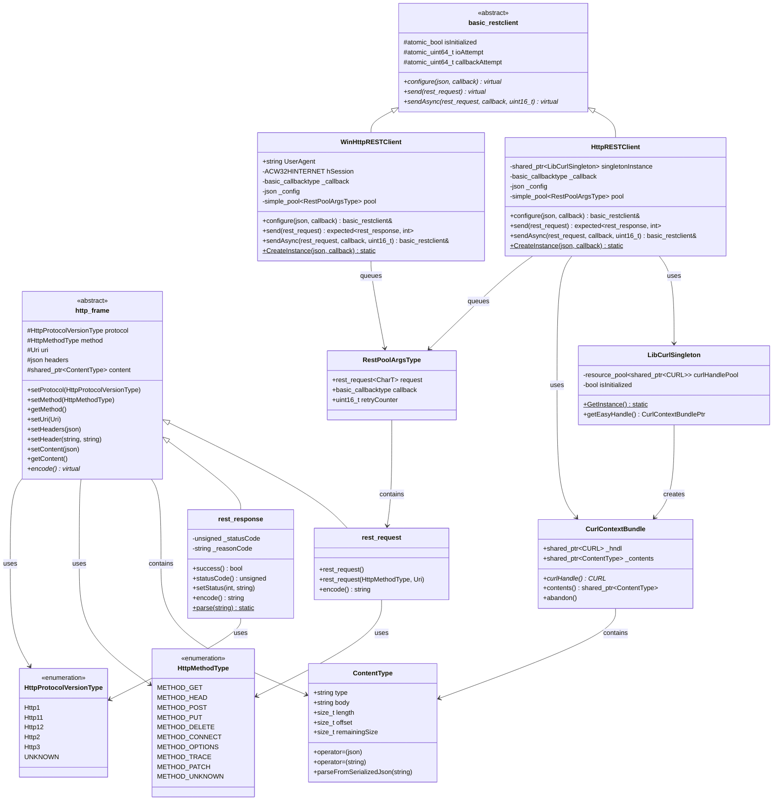

# RestCL Class Diagram

## Class Hierarchy Overview

### Core Architecture

1. **http_frame** (Abstract Base)
   - Base class for HTTP protocol handling
   - Manages protocol version, HTTP method, URI, headers, and content
   - Provides fluent API for building HTTP messages

2. **rest_request** (Extends http_frame)
   - Models HTTP requests
   - Supports user-defined literals (_GET, _POST, _PUT, etc.)
   - Encodes to HTTP wire format

3. **rest_response** (Extends http_frame)
   - Models HTTP responses
   - Parses HTTP wire format
   - Validates success status codes (100-399)

4. **basic_restclient** (Abstract Base)
   - Defines REST client interface
   - Declares synchronous send() and asynchronous sendAsync() methods
   - Tracks I/O and callback statistics

### Platform-Specific Implementations

#### Unix/Linux/macOS
- **HttpRESTClient** (Extends basic_restclient)
  - Uses libcurl for HTTP operations
  - **LibCurlSingleton**: Manages global libcurl initialization and handle pooling
  - **CurlContextBundle**: RAII wrapper for checked-out CURL handles
  - Thread pool for async operations

#### Windows
- **WinHttpRESTClient** (Extends basic_restclient)
  - Uses WinHTTP API for HTTP operations
  - Native Windows HTTP implementation
  - Thread pool for async operations

### Supporting Classes

- **ContentType**: Manages HTTP message body with type, length, and streaming state
- **RestPoolArgsType**: Container for async request queue items

## Key Design Patterns

1. **Template Metaprogramming**: Generic CharT template for character type flexibility
2. **RAII**: Resource management for CURL handles and HTTP connections
3. **Factory Pattern**: Platform-specific client creation
4. **Thread Pool**: Async request processing with automatic retry logic
5. **Fluent API**: Method chaining for request building
6. **User-Defined Literals**: Convenient request creation syntax
7. **std::expected**: Error handling without exceptions
