# CMake & Submodules

`restcl` provides first-class modern CMake targets for seamless inclusion in your build configuration.

---

## Using `add_subdirectory`

1. Add `restcl` as a Git submodule in your project repository:
   ```bash
   git submodule add https://github.com/SiddiqSoft/restcl.git vendor/restcl
   ```

2. Add the following to your `CMakeLists.txt`:
   ```cmake
   cmake_minimum_required(VERSION 3.20)
   project(MyRestApp LANGUAGES CXX)

   set(CMAKE_CXX_STANDARD 23)
   set(CMAKE_CXX_STANDARD_REQUIRED ON)

   # Include restcl
   add_subdirectory(vendor/restcl)

   add_executable(MyRestApp main.cpp)
   target_link_libraries(MyRestApp PRIVATE siddiqsoft::restcl)
   ```

---

## Using CPM / FetchContent

You can also pull `restcl` directly via CMake `FetchContent`:

```cmake
include(FetchContent)

FetchContent_Declare(
    restcl
    GIT_REPOSITORY https://github.com/SiddiqSoft/restcl.git
    GIT_TAG        main
)
FetchContent_MakeAvailable(restcl)

target_link_libraries(MyRestApp PRIVATE siddiqsoft::restcl)
```

or use the [cpm-cmake](https://github.com/cpm-cmake/cpm.cmake):

```cmake
# download CPM.cmake..
file(DOWNLOAD https://github.com/cpm-cmake/CPM.cmake/releases/download/v0.42.3/CPM.cmake ${CMAKE_CURRENT_SOURCE_DIR}/pack/CPM.cmake)
# import the helper into our process..
include(pack/CPM.cmake)

..
..

CPMAddPackage("gh:SiddiqSoft/restcl#2.3.8")
target_link_libraries(${PROJECT_NAME} INTERFACE restcl::restcl)

```

---

## Compiler Flags

Ensure C++23 standard support is enabled:

=== "MSVC (Windows)"
    ```cmake
    target_compile_options(MyRestApp PRIVATE /std:c++latest)
    ```

=== "Clang / GCC (Linux/macOS)"
    ```cmake
    target_compile_options(MyRestApp PRIVATE -std=C++23)
    ```

---

## Dependencies Diagram

Dependencies declared and managed by `restcl`'s [`CMakeLists.txt`](https://github.com/SiddiqSoft/restcl/blob/main/CMakeLists.txt):

```mermaid
graph TD
    restcl["restcl::restcl"]

    subgraph Platform["Platform-Specific HTTP Backend"]
        ACW["acw32h v2.7.4 (Windows / MSVC)"]
        CURL["libcurl >= 8.7 (Linux / macOS)"]
    end

    subgraph Core["Core Dependencies (via CPM)"]
        JSON["nlohmann_json v3.12.0"]
        URI["SplitUri v3.0.3"]
        AZURE["AzureCppUtils v3.2.9"]
        S2M["string2map v2.6.1"]
        ROE["RunOnEnd v1.4.5"]
        RWL["RWLEnvelope v1.5.3"]
        ASYNC["asynchrony v2.3.3"]
        ARRP["arrp v1.2.0"]
        CTRE["ctre v3.11.0"]
    end

    subgraph Test["Test Dependencies (Optional)"]
        GTEST["googletest v1.17.0"]
    end

    restcl --> ACW
    restcl --> CURL
    restcl --> JSON
    restcl --> URI
    restcl --> AZURE
    restcl --> S2M
    restcl --> ROE
    restcl --> RWL
    restcl --> ASYNC
    restcl --> ARRP
    restcl --> CTRE
    restcl -. "BUILD_TESTS=ON" .-> GTEST
```



