# Integration Guide

`restcl` is a header-only library designed for quick integration into modern C++ projects.

---

## Integration Options

Choose your preferred integration method:

=== "CMake / Submodules"

    Ideal for cross-platform CMake projects on Windows, Linux, or macOS.

    ```cmake
    add_subdirectory(vendor/restcl)
    target_link_libraries(your_target PRIVATE siddiqsoft::restcl)
    ```

    [View CMake Integration Guide :octicons-arrow-right-24:](cmake.md)

=== "NuGet Package"
    
    > **DEPRECATED!**
    >
    > Not all dependencies used by this project have nuget packages anymore!

    Ideal for Visual Studio C++ projects on Windows.

    ```powershell
    Install-Package SiddiqSoft.restcl
    ```

    [View NuGet Integration Guide :octicons-arrow-right-24:](nuget.md)

---

## Header Includes

Include the primary header to automatically load the appropriate implementation for your platform:

```cpp
#include "siddiqsoft/restcl.hpp"
```

If you only target Windows with WinHTTP explicitly:

```cpp
#include "siddiqsoft/restcl_winhttp.hpp"
```

---

## Dependencies

The diagram below lists the dependencies for `restcl` derived directly from [`CMakeLists.txt`](https://github.com/SiddiqSoft/restcl/blob/main/CMakeLists.txt):

```mermaid
graph TD
    restcl["restcl::restcl"]

    subgraph Platform["Platform-Specific HTTP Backend"]
        ACW["acw32h v2.7.4 (Windows / MSVC)"]
        CURL["libcurl >= 8.7 (Linux / macOS)"]
    end

    subgraph Core["Core Dependencies (via CPM)"]
        JSON["nlohmann_json v3.12.0"]
        URI["SplitUri v3.0.3"]
        AZURE["AzureCppUtils v3.2.9"]
        S2M["string2map v2.6.1"]
        ROE["RunOnEnd v1.4.5"]
        RWL["RWLEnvelope v1.5.3"]
        ASYNC["asynchrony v2.3.3"]
        ARRP["arrp v1.2.0"]
        CTRE["ctre v3.11.0"]
    end

    subgraph Test["Test Dependencies (Optional)"]
        GTEST["googletest v1.17.0"]
    end

    restcl --> ACW
    restcl --> CURL
    restcl --> JSON
    restcl --> URI
    restcl --> AZURE
    restcl --> S2M
    restcl --> ROE
    restcl --> RWL
    restcl --> ASYNC
    restcl --> ARRP
    restcl --> CTRE
    restcl -. "BUILD_TESTS=ON" .-> GTEST
```



### Dependency Breakdown

| Dependency | Target / Library | Version | Platform / Scope |
| :--- | :--- | :--- | :--- |
| **libcurl** | `CURL::libcurl` | &ge; 8.7 | Linux / macOS (GCC, Clang, AppleClang) |
| **acw32h** | `acw32h::acw32h` | 2.7.4 | Windows (MSVC) |
| **nlohmann_json** | `nlohmann_json::nlohmann_json` | 3.12.0 | All Platforms (INTERFACE) |
| **SplitUri** | `SplitUri::SplitUri` | 3.0.3 | All Platforms (INTERFACE) |
| **AzureCppUtils** | `AzureCppUtils::AzureCppUtils` | 3.2.9 | All Platforms (INTERFACE) |
| **string2map** | `string2map::string2map` | 2.6.1 | All Platforms (INTERFACE) |
| **RunOnEnd** | `RunOnEnd::RunOnEnd` | 1.4.5 | All Platforms (INTERFACE) |
| **RWLEnvelope** | `RWLEnvelope::RWLEnvelope` | 1.5.3 | All Platforms (INTERFACE) |
| **asynchrony** | `asynchrony::asynchrony` | 2.3.3 | All Platforms (INTERFACE) |
| **arrp** | `arrp::arrp` | 1.2.0 | All Platforms (INTERFACE) |
| **ctre** | `ctre::ctre` | 3.11.0 | All Platforms (INTERFACE) |
| **googletest** | `GTest::gtest_main` | 1.17.0 | Test Target Only (`restcl_BUILD_TESTS=ON`) |

